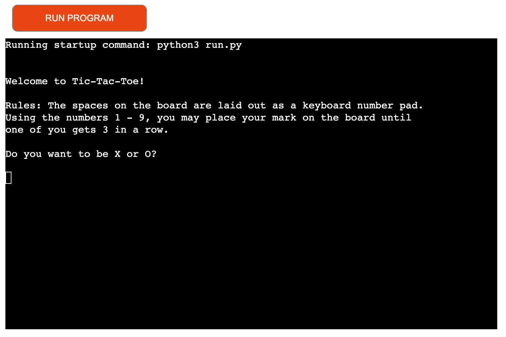

# Tic Tac Toe

Tic-Tac-Toe is a Python terminal game played against a computer with one player being X whilst the other is O. Players take turns placing their X or O on the board until one player gets three of their marks in a row, column, or diagonal, making them the winner. If neither player gets three marks in any direction, the game ends in a draw.

Link to game - <a href="https://tic-tac-toe-o.herokuapp.com/" target="blank" rel="noopener" aria-label="Visit Tic Tac Toe (Opens in a new tab)"> Click Here!</a>

## User Stories

As a user, i want to be able to:

- Select which character i want to be.
- Have a clear understanding of how to play.
- Be given the option to play more than 1 round.
- See who has won at the end of a match.

## Features

- __Start Up Page__

The start up page displays an introduction to the game and instructions on how to play. It then follows up with a question asking whether you want to be X or O.

The instructions are made clear so the user can understand how the game works and which controls to use.

- __Playing The Game__

When the game is in progress, the Python code will begin to run and either the user or computer will be prompted to make the first move. It will then keep running and asking the user for input on where they would like to place their character until one of the players achieve three in a row or draw.

## Testing

I have tested this game in different browsers to ensure it works with Chrome,Safari etc...

I have ensured this project is responsive and functional.

I confirm that the text and design displayed throughout the game is visable to users. 

I have made sure that the game ends correctly and displays the winner according to the score.

### User Story Testing 

- Select which character i want to be: When opening the game, i am greeted with a welcome message and given the option to select if i want to be X or O.

- Have a clear understanding of how to play: With the introduction, the game rules are presented and are easy to follow.

- Be given the option to play more than 1 round: Once a match has come to an end, i am able to chose if i want to play again or not.

- See who has won at the end of a match: I am able to see who has won the game with the text that is displayed under the board.

### Bugs

I came across a bug where i wasn't able to run an `if` statement to check if one of the players have completed 3 in a row, it was continually throwing an error. After speaking to a tutor at Code Institute, i managed to see where i was going wrong and didn't need the additional brackets within the statement. Once i removed them, the code was running as it should. 

### Validator Testing

- __PEP8__

I can confirm no errors are returned after passing the PEP8online checker

### Unfixed Bugs

No unfixed bugs.

## Version Control

### Git & Github

I used GitPod as a IDE and local repository & GitHub as a remote repository. The process was as follows:
- I created a new repository on GitHub.
- Then, i had opened that repository on GitPod and started coding.
- I then started saving my work and pushing it to the GitHub repository to keep it safe.
- The process for saving, commiting and pushing it to remote repository was to (done in terminal): 
  - `git add . ` for adding work to git.
  - `git commit -m "Commit message" ` to commit the work on the stage.
  - `git push ` to push work up to GitHub.

## Deployment

This project was deployed using Code Institute's mock terminal for Heroku. The steps to deploy were as follows:

- Clone the repository and create one for Tic-Tac-Toe.
- Create a new Heroku app and set the buildbacks to `Python` and `NodeJS`.
- Link the Heroku app to the repository and click `Deploy`.

## Credits

I used a site called Doing Math With Python & StackOverflow to help me understand some of the code.
